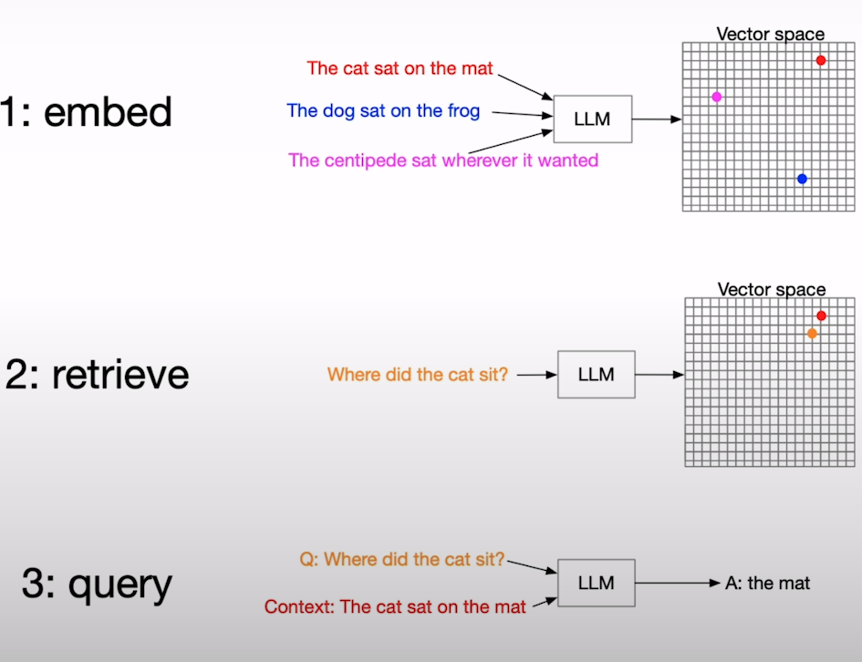
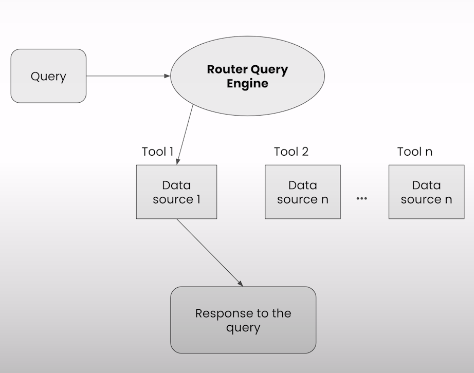

# JavaScript RAG Web Apps with LlamaIndex

Url: https://learn.deeplearning.ai/courses/javascript-rag-web-apps-with-llamaindex

## 1. Getting started with RAG

### RAG recap

A solution to limited context windows

- **Retrieve** most relevant data
- **Augment** query with context
- **Generate** response

### Why RAG?

- RAG is addressing a shortcoming found in LLMs.
- Not trained on your data.
- Your data is vaulable and interesting to you.
- LLMs can't handle all your data at once!
- Continously uploading your extensive data to LLMs every time you want to ask it a question is not practical, even if possible.

> **You have to be selective** and that's tricky.

### Vector embeddings

### Query engine

This convenience function combines several components:

- **Retriever**: get relevant context out of the index.
- **Postprocessing**: process the nodes your retriever fetched, before giving them to the LLM.
- **Synthesizer**: combine the processed nodes, prompt template and query into a single prompt to the LLM.

> The notebook for this section is found at: `/assets/notebooks/1`

## 2. Build a full-stack web app

* **Backend web api**
    * How the API is called
    * How to integrate LlamaIndex into your API
* **Interactive Frontend component in React**
    * How it calls the API
    * How it displays the results to your queries

> The notebook for this section is found at: `/assets/notebooks/2`

## 3. Advanced queries with Agents

Limitations of RAG and how agents can help with it.

In a real-life app we can have multiple types of data that focus on different kinds of answers.

LLMs can create multiple data sources, tell what everyone is used for and the LLM can choose which one to query.

> The notebook for this section is found at: `/assets/notebooks/3`

## 4. Production-ready techniques

* **Persisting your data**: Persist your data in a vector store (like a vector database). We don't want to load the data in production every time.
* **Chatting with your data**: Ask follow up questions.
* **Streaming**: Give responses instantly. Send the answer piece by piece.

Create a working web app using llamaIndex is as easy as: `npx create-llama`.

> The notebook for this section is found at: `/assets/notebooks/4`