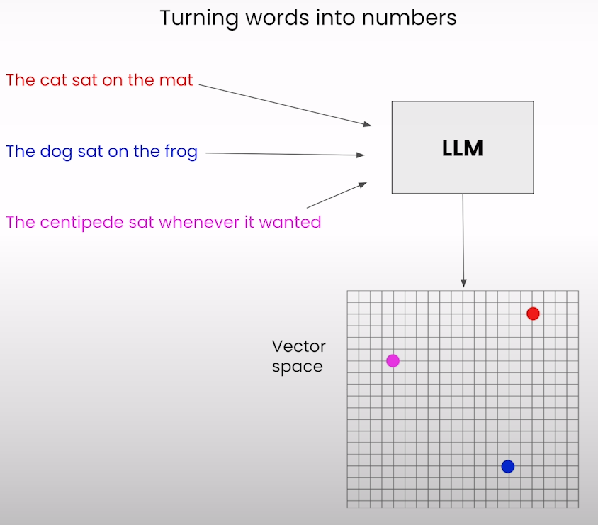

# JavaScript RAG Web Apps with LlamaIndex

## 1. Getting started with RAG

### RAG recap

A solution to limited context windows

- **Retrieve** most relevant data
- **Augment** query with context
- **Generate** response

### Why RAG?

- RAG is addressing a shortcoming found in LLMs.
- Not trained on your data.
- Your data is vaulable and interesting to you.
- LLMs can't handle all your data at once!
- Continously uploading your extensive data to LLMs every time you want to ask it a question is not practical, even if possible.

> **You have to be selective** and that's tricky.

### Vector embeddings

### Query engine

This convenience function combines several components:

- **Retriever**: get relevant context out of the index.
- **Postprocessing**: process the nodes your retriever fetched, before giving them to the LLM.
- **Synthesizer**: combine the processed nodes, prompt template and query into a single prompt to the LLM.

> The notebook for this section is found at: `/assets/notebooks/1`
